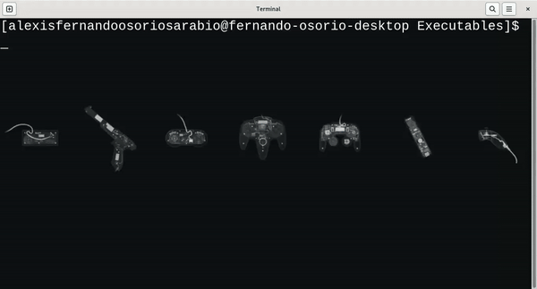

#  Compilation

### Before doing anything, I am assuming:

1. You have installed GNU ``g++`` compiler.
2. The command-line interface software GNU ``Make`` is installed in your computer.

In order to check if you have ``g++`` available you can run:

- For Windows:
    - Open command prompt; one way to do this is searching *cmd* in Start menu.
    - Type ``g++ --version`` and press enter.

- For macOS and Linux:
    - Open terminal application.
    - Type ``g++ --version`` and press enter.

If you do not have this compiler installed, I strongly recommend you to install the GNU compiler collection (GCC). Installation
instructions can be found here:
[Linux](https://www.geeksforgeeks.org/how-to-install-gcc-compiler-on-linux/), 
[MacOS](https://cs.millersville.edu/~gzoppetti/InstallingGccMac.html),
[Windows](https://www.ibm.com/docs/en/devops-test-embedded/9.0.0?topic=overview-installing-recommended-gnu-compiler-windows).

To verify if you hame GNU ``make`` installed:

- For Linux and macOS:
    - Open terminal application.
    - Type ``make --version``

To install GNU ``make``, you can follow the instructions of the following links:
[Windows](https://stackoverflow.com/a/57042516), 
[MacOS](https://ipv6.rs/tutorial/macOS/GNU_Make/)

## Use make commands

Use ``make`` commands to build the executables.

1. ``make AESencryption.exe`` to build executable for encryption.
2. ``make AESdecryption.exe`` to build executable for decryption.
3. ``make`` to build both.

Optionally, you can run the following commands on your terminal (command prompt on Windows)

For AESencryption.exe:
```
# This is, literally, the command that "make AESencryption.exe" calls.
g++ -o AESencryption.exe -Wall -Weffc++ -Wextra -Wsign-conversion -pedantic-errors -ggdb -fno-omit-frame-pointer -O2 -std=c++2a
../encryption.cpp ../Settings.cpp ../../Source/*.cpp
```

For AESdecryption.exe:
```
# This is, literally, the command that "make AESdecryption.exe" calls.
g++ -o AESdecryption.exe -Wall -Weffc++ -Wextra -Wsign-conversion -pedantic-errors -ggdb -fno-omit-frame-pointer -O2 -std=c++2a
../decryption.cpp ../Settings.cpp ../../Source/*.cpp
```

These last two commands are convenient if you do not have ``make`` installed. 

# Passing arguments to the executables.
**Important**: Right now I am assuming you have a key available; if you do not, please run the encryption executable with no
arguments:
```
./AESencryption.exe
```
Then, the program will give you instructions for the creation of public-private key pairs (and other encryption options, if desired).
The following image shows the process creating and saving keys:



We can pass arguments to the executables to encrypt/decrypt a single file. Set as first argument the name/path of the encryption
key we want to use followed by the files (currently supported) that are meant to be encrypted as the following arguments, this
will encrypt/decrypt the files using the key referenced in the first argument.

**Examples:**

Note: Videos were edited to decrease the size of these gifts.

1. Encrypting two ``bmp`` images by passing the relative paths of these files to the executable. In concrete, executing:
``./AESencryption.exe AESencryption.aeskey Files_for_testing/Pic00.bmp Files_for_testing/Pic01.bmp``.


2. Decrypting two text files by passing the relative paths of these files to the executable. In concrete, executing:
``./AESdecryption.exe AESencryption.aeskey Files_for_testing/Text00.txt Files_for_testing/Text01.txt``.


